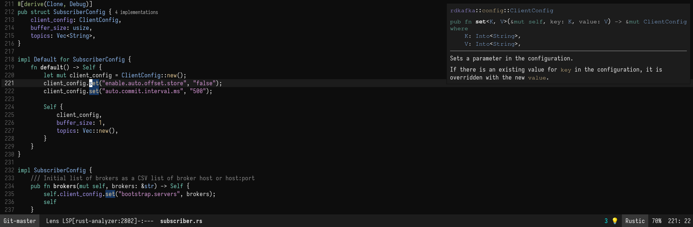

# Fleetish Theme for Emacs

[](https://melpa.org/#/fleetish-theme)

A take on the JetBrains Fleet theme

## Installation

### use-package

```elisp
(use-package fleetish-theme
  :config
  (load-theme 'fleetish t))
```

## Screenshots

### Rustic (Rust)


